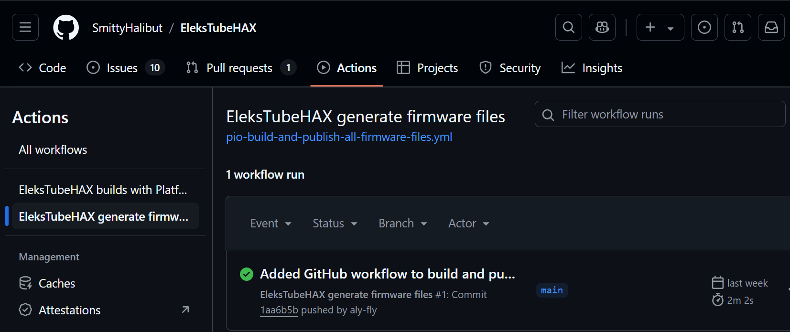
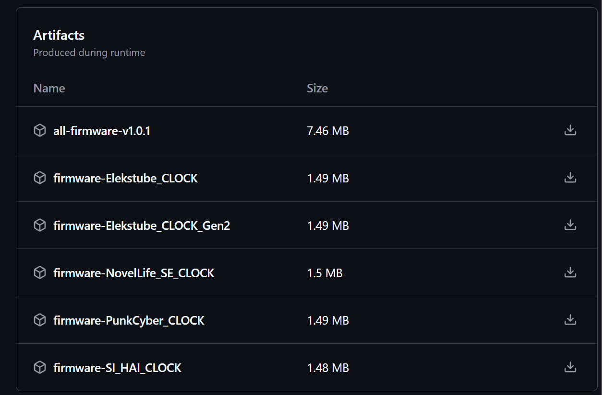

# EleksTubeHAX - An aftermarket custom firmware for the desk clock

## 1. Pre-built firmware files

In this folder you can find pre-built firmware image files that you can directly upload/flash to your clock.

These firmwares may have limited functionality compared to a self-built firmware, because not all available features are enabled or can be configured.

The image files (clock faces) are fixed and can't be changed without building your own firmware file with the development tools (see README.md)!

### 1.1 Pre-configured functionality

Enabled:

- WiFi connectivity via WPS (While clock is in boot phase, press WPS button on your router for WiFi setup).
- Night time dimming enabled - from 22:00h (10 pm) in the evening to 07:00h (7 am) in the morning.

Disabled:

- IP-based geolocation disabled - time zone & DST must be set manually via the menu.
- MQTT disabled - no 'remote control'. Because of this, also no Home Assistant support!
- Debug Outputs via serial interface is disabled

General:

- 6 different sets of clock faces present. See [data](https://github.com/SmittyHalibut/EleksTubeHAX/tree/main/EleksTubeHAX_pio/data).
- BMP mode active for the given clock faces
- CORE_DEBUG_LEVEL=5 - This produces diagnostic messages from the ESP32 "operating system" in case of an error over the serial interface.

## 2. Backup your original firmware

**Always backup YOUR clock firmware version as first step!**

Save your original firmware using the `_ESP32 save flash 4MB.cmd` by changing the COM port to the number, your clock uses.

Rename and store the `backup1.bin` on a save location.

See also the section "Backup first" and following in the `README.MD` file in the root.

## 3. Available image files

In this folder (```pre-build-firmwares```) you will find the flashable files.
They are updated from time to time in the repository, so version number may vary.

| clock model | firmware image file |
|--|--|  
| EleksTube IPS - Orginal Version | `FW_Elekstube_HAX_1.0_original.bin` |
| EleksTube IPS - Gen2 models | `FW_Elekstube_HAX_1.0_Gen2-1.bin` |
| SI HAI IPS | `FW_SI_HAI_CLOCK_HAX_1.0.bin` |
| NovelLife SE version | `FW_NovelLife_SE_HAX_1.0.bin` |
| PunkCyber/RGB Glow Tube DIY | `FW_PunkCyber_Glow_PCBway_HAX_1.0.bin` |

Note: All "Original" EleksTube clocks, sold after July 2022 are "Gen2" versions. See [Note on EleksTube website](https://elekstube.com/blogs/news/instructions-on-elekstube-clock-for-gen2-systems). But always check the PCB version of your clock!

## 4. Write the EleksTubeHAX firmware file

- Choose the right pre-built firmware file for your clock.
- Edit the file `_ESP32 write flash.cmd` with an editor.
- Write the correct COM port of your clock.
- Write the correct firmware file name for your clock.
- Run the CMD file.

The CMD file should look like this:

```esptool --port COM5 --baud 921600 write_flash --erase-all 0x0000 FW_Elekstube_HAX_1.0_Gen2-1.bin```

Note: Most clocks will go into to the "download mode" automatically when esptool is trying to write to it.
Some clocks needs a button pressed while the powering phase (plugging the USB cable) to enter this mode.

## 5. Download the newest firmware files

Everytime a commit is done to the main branch of this repo, a GitHub action is triggered and a workflow run builds all firmware files.

All workflow runs of the GutHub action can be found under [EleksTubeHAX generate firmware files]("https://github.com/SmittyHalibut/EleksTubeHAX/actions/workflows/pio-build-and-publish-all-firmware-files.yml")

Should look like:



The first entry is always the newest.

If you click on the workflow run, you will be able to donwload either all firmwares at once, by downloading the `all-firmware-vX.X.X`, or the file for your clock seperately.



The downloaded firmware file can be flashed to the clock modifing the existing CMD file or using the esptool directly.

## 6. There is no warranty of any type

Use at your own risk!

If you mess-up your clock, it's only your fault!
